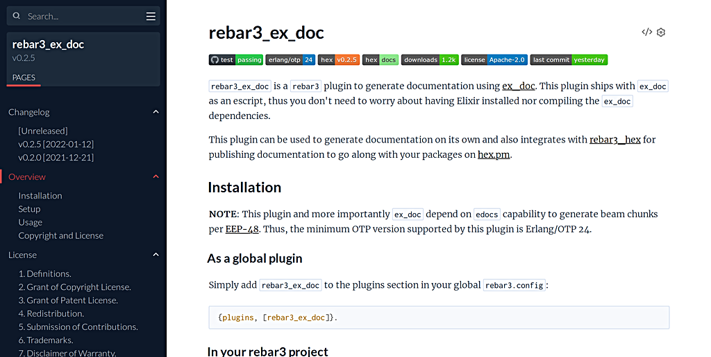

# rebar3_ex_doc

[](https://github.com/starbelly/rebar3_ex_doc/actions/workflows/ci.yml)
[](http://www.erlang.org)
[](https://hex.pm/packages/rebar3_ex_doc)
[](https://hexdocs.pm/rebar3_ex_doc/)
[](https://hex.pm/packages/rebar3_ex_doc)
[](https://github.com/starbelly/rebar3_ex_doc/blob/main/LICENSE)
[](https://github.com/starbelly/rebar3_ex_doc/commits/main)

`rebar3_ex_doc` is a `rebar3` plugin to generate documentation using [ex\_doc](https://github.com/elixir-lang/ex_doc). This plugin ships with `ex_doc` as an escript, thus you don't need to worry about having Elixir installed nor compiling the `ex_doc` dependencies.

<div style="text-align: center;">
  
</div>

This plugin can be used to generate documentation on its own and also integrates with [rebar3_hex](https://github.com/erlef/rebar3_hex) for publishing documentation to go along with your packages on [hex.pm](https://hex.pm/).

## Installation

**NOTE**: This plugin and more importantly `ex_doc` depend on `edocs` capability to generate beam chunks per [EEP-48](https://www.erlang.org/doc/apps/edoc/doc_storage.html).

## Maintenance window

The minimum OTP version supported by this plugin is Erlang/OTP 25.

### As a global plugin

Simply add `rebar3_ex_doc` to the plugins section in your global `rebar3.config`:

```erlang
{plugins, [rebar3_ex_doc]}.
```

### In your rebar3 project

You can add this plugin to your rebar3 project as a project plugin, like so:

```erlang
{project_plugins, [rebar3_ex_doc]}.
```

## Setup

This plugin should work out of the box, but the following configuration is recommended when publishing documentation to [hex.pm](https://hex.pm).

Simply add the configuration below to your `rebar.config` and adjust for your project:

```erlang
{ex_doc, [
     {extras, ["README.md", "LICENSE"]},
     {main, "README.md"},
     {source_url, "https://github.com/namespace/your_app"}
]}.
```

For further customization, see the configuration for `rebar3_ex_doc`:

```erlang
{ex_doc, [
    {extras, [
          {"CHANGELOG.md", #{title => "Changelog"}},
          {"README.md", #{title => "Overview"}},
          {"LICENSE.md", #{title => "License"}}
    ]},
    {main, "README.md"},
    {homepage_url, "https://github.com/starbelly/rebar3_ex_doc"},
    {source_url, "https://github.com/starbelly/rebar3_ex_doc"},
    {assets, "assets"},
    {api_reference, false}
]}.
```

Please see the `ex_doc` [configuration documentation](https://hexdocs.pm/ex_doc/Mix.Tasks.Docs.html#module-configuration) for a complete overview of available configuration directives.

You may also use an external config file by specifying a path instead of a proplist. See `ex_doc --help` for more info.

```erlang
%% In Elixir format
{ex_doc, "docs.exs"}.

%% Or in Erlang term, like rebar.config
{ex_doc, "docs.config"}.
```

### Umbrella support

Umbrellas are supported but they must be configured on an app by app basis. This is to avoid publishing documentation to Hex.pm with wrong source urls, logos, etc.

Specifically, for each app you wish to generate documentation for, and more importantly publish to hex.pm, you should place a `rebar.config` in each app directory with the desired configuration for that application.

## Usage

After the plugin has been added to your project you can simplly run `rebar3 ex_doc` to generate your docs and view them in your favorite browser.

Run `rebar3 help ex_doc` to see all available options.

### Integrating with rebar3_hex

We highly recommend using `rebar3_ex_doc` as the documentation provider for all your hex projects to provide the users of our ecosystem with a consistent documentation format and style.

To integrate with `rebar3_hex` merely specify `rebar3_ex_doc` as the doc provider in your projects hex configuration in `rebar.config` :

```erlang
{hex, [
    {doc, #{provider => ex_doc}}
]}.
```

#### packages

rebar3_ex_doc optimizes for applications intended to be published to [hex.pm](https://hex.pm) such that
the application name is passed to ex_doc by default as the value to the package option.

If you wish to generate documentation outside the context of a package you may specify `{package, false}` in the options :

```erlang
{ex_doc, [
     {package, false},
     {extras, ["README.md", "LICENSE"]},
     {main, "README.md"},
     {source_url, "https://github.com/namespace/your_app"}
]}.
```

### Supported options

Not all `ex_doc` options are supported. This means we'll warn on unknown options, but still pass them to `ex_doc`. We try to make sure the supported options are converted to the format known by `ex_doc`.
In case you get a warning for something that is working or would like further conversion support, open a [GitHub issue](https://github.com/starbelly/rebar3_ex_doc/issues).

### Additional options

#### Support for Mermaid

Out-of-the-box support for [Mermaid](https://mermaid.js.org/) is provided via `rebar.config` option
`with_mermaid`, as follows:

```erlang
{ex_doc, [
     {with_mermaid, true}
]}.
```

or

```erlang
{ex_doc, [
     {with_mermaid, "10.2.4"}
]}.
```

Check out what this looks like in `doc/index.html`.


#### v prefix for source ref versions

By default rebar3_ex_doc adopts the convention of prefixing versions with `v`.
If your project doesn't follow this convention you may opt out of it with `{prefix_ref_vsn_with_v, false}`

```erlang
{ex_doc, [
     {prefix_ref_vsn_with_v, false},
     {extras, ["README.md", "LICENSE"]},
     {main, "README.md"},
     {source_url, "https://github.com/namespace/your_app"}
]}.
```

### Examples

Check out our [examples](https://github.com/starbelly/rebar3_ex_doc/tree/main/examples) directory in this repository for working project examples.

### Extras

ExDoc [extras](https://hexdocs.pm/ex_doc/readme.html#additional-pages) are additional pages of content written in Markdown. When used with `rebar3_ex_doc`, Erlang syntax is supported for auto-link references with ExDoc prefixes (`c:` and `t:`):

* Modules: `module`
* Functions: `function/1`, `module:function/1`
* Callbacks: `c:handle_call/3`, `c:gen_server:handle_call/3`
* Types: `t:nullary_type()`, `t:type_with_parameter/1`

# Development

If you'd like to hack on this plugin, follow the steps below:

1. You must have at least Elixir 1.13.0
   [installed](https://elixir-lang.org/install.html) to build the `ex_doc`
   escript.

2. Make a new rebar project or go into an existing project:

    ```bash
    rebar3 new myapp
    cd myapp
    ```

3. Make a `_checkouts` directory:

    ```bash
    mkdir _checkouts
    ```

4. Go to `_checkouts` and clone this repository to create a
   [checkout dependency](http://rebar3.org/docs/configuration/dependencies/#checkout-dependencies):

    ```bash
    cd _checkouts
    git clone https://github.com/starbelly/rebar3_ex_doc
    ```

5. Get all dependencies and build the `ex_doc` console app:

    ```bash
    cd rebar3_ex_doc
    mix deps.get
    mix escript.build
    ```

6. Go back to the root of your project:

    ```bash
    cd ../..
    ```

7. Add `rebar3_ex_doc` as plugin to your `rebar.config`:

    ```erlang
    {project_plugins, [rebar3_ex_doc]}.
    ```

8. Generate documentation as an initial test:

    ```bash
    rebar3 ex_doc
    ```

## Copyright and License

Copyright 2021, Bryan Paxton <bryan@starbelly.io>.

Licensed under the Apache License, Version 2.0 (the "License");
you may not use this file except in compliance with the License.
You may obtain a copy of the License at [https://www.apache.org/licenses/LICENSE-2.0](https://www.apache.org/licenses/LICENSE-2.0).

Unless required by applicable law or agreed to in writing, software
distributed under the License is distributed on an "AS IS" BASIS,
WITHOUT WARRANTIES OR CONDITIONS OF ANY KIND, either express or implied.
See the License for the specific language governing permissions and
limitations under the License.
