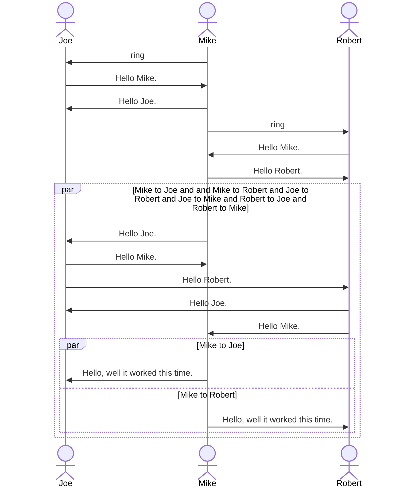

mermaid_map example
=====

Example project to show how you can use rebar3_ex_doc and ex_doc to generate mermaid graphs in your markdown docs using
the `before_closing_head_tag` and a map of strings keyed to supported ex_doc output targets (e.g., html, epub, etc.).

